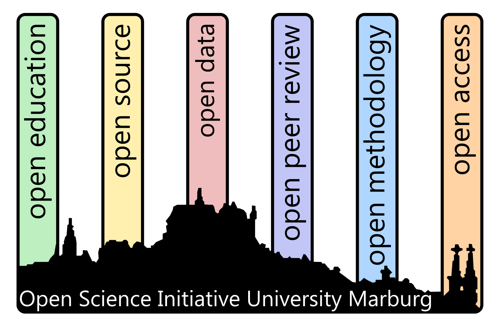

## OSIUM Hackathon - BrainhackSchool 2025 in June 2025 online

The Brainhack School is a collaborative, 4-week long hands-on training program in open neuroscience and data science, redesigned here as a flipped classroom.

Participants engage with pre-recorded lectures and tutorials developed and peer-reviewed by international domain experts. The topics cover a wide range from version control, neuroimaging tools, reproducibility, and machine learning to general research software practices, making them valuable well beyond neuroscience. 
Students choose the modules most relevant to their own interests and discipline.

The Brainhack School in Marburg follows a flipped classroom approach:
Students choose the modules most relevant to their own interests and discipline. To support self-directed learning, tutors offer regular office hours for individual consultation and clarification. 
This flexible and inclusive format enables interdisciplinary participation and promotes sustainable skill-building in open science and data literacy.

 

 

**Schedule**:

| Date | Event | Setting |
|:---------------|:--------------|:---------------|
| June 2nd-27th | self-paced study period | Participants start with a self-paced study phase, during which they dive into a personalized selection of high-quality modules that best match their interests and research goals. |
| Mondays 15:00 | weekly open office hour | Throughout the self-learning phase, tutors offer regular office hours to support participants with questions, provide guidance, and foster peer exchange. |

**costs**: The participation is for free!

**register**: <a href="https://redcap.kks.uni-marburg.de/surveys/?s=XPWKTAAW3W7N7KRE">REGISTER</a>

The Marburg BrainhackSchool is organized by 

and supported by

<!--  -->

 
 
[back](./)
