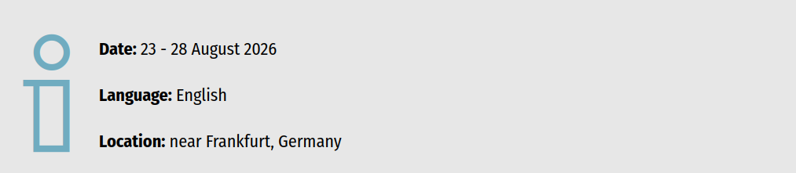
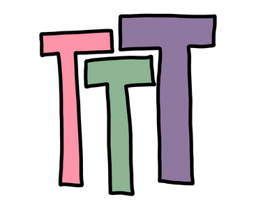

# Upcoming Events - Save the Date!!

## Metascience Summer School

 

**Details** on the Metascience Summer School can be found <a class="twitter-timeline" href="https://www.bihealth.org/de/aktuell/meta-science-summer-school-designing-and-conducting-studies-to-improve-research-1" data-tweet-limit="1" data-height="300">here</a>! The Metascience Summer School is organized by the Quest Center and supported by OSIUM via the German Reproducibility Network.
 

---

## One-Day Train the Trainer Retreat 2026

 

**Date**: 2.11.2026
**Location**: Marburg, Creative Space (Bahnhofstraße)
**Language**: English or German (participants' decision)

**Details** including the REGISTRATION option can be found <a class="twitter-timeline" href="https://openscienceinitiativeuniversitymarburg.github.io/train-the-trainer-retreat-2026.html" data-tweet-limit="1" data-height="300">here</a>!
 

---

# Regular Events

## Monthly Open Office Hour
We offer <a href="https://webconf.hrz.uni-marburg.de/n/rooms/q2o-bf3-vtf-u8q/join">office hours</a> where you can join the online meeting and ask your questions on Open Science (every first Monday in the month 13:00 o'clock). 

## Hackathons & Retreats
We organize community events formats, such as peer2peer workshops, hackathons and retreats: [Past Events](./past-events.md).

---
# OSIUM Calendar

<iframe src="https://calendar.google.com/calendar/embed?height=600&amp;wkst=2&amp;hl=en&amp;src=osium.contact%40gmail.com&amp;ctz=Europe%2FBerlin" style="border-width:0" width="800" height="600" frameborder="0" scrolling="no"></iframe>

---

# [JOIN OUR TEAM!](./join.md)

[back](./)
