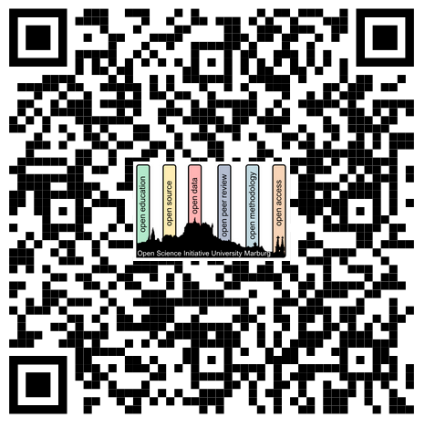

# Upcoming Events

## Open Science Days Marburg 2024

Join us for the **Open Science Days 2024** hosted by the Open Science Initiative University Marburg (OSIUM) in collaboration with the Profilmodul Methoden der Biologischen Psychiatrie! This exciting event is an opportunity for **researchers from all disciplines**, to engage with **Open Science** and collaborate in a peer-to-peer hacky session. The event spans three dynamic sessions:

→ **Day 1: November 21, 15:00-18:00 – Introduction to Open Science**
Discover the principles of Open Science and explore how transparency and collaboration can elevate your research, no matter your field.

→ **Day 2: November 28, 15:00-18:00 – Introduction to Research Data Management**
Learn the essential practices of managing research data effectively, ensuring it is FAIR (Findable, Accessible, Interoperable, and Reusable) and adaptable across disciplines.

→ **Day 3: December 5, 15:00-18:00 – Hack Day: Collaborative Project Work**
Work hands-on with peers to apply Open Science principles to real-world projects. This session builds on the previous two, fostering cross-disciplinary collaboration and innovation.

Whether you're new to Open Science or looking to deepen your expertise, the Open Science Days are open to researchers from all areas, from the natural sciences to the social sciences and humanities. Come **for free** to enhance your skills, connect with like-minded researchers, and be part of the movement towards more transparent, reproducible, and collaborative science!

 

→ <a href="https://forms.gle/AQAYYaKWYp1oYmnGA">REGISTER</a>

 

The Open Science Days 2024, supported by <a href="https://www.uni-marburg.de/de/mara">MARA</a>, <a href="https://www.uni-marburg.de/de/forschung/kontakt/eresearch">eResearch Center</a>, <!-- <a href="https://fid-media.de/">Fachinformationsdienst Kommunikations- und Medienwissenschaften (FID Media)</a>  , <a href="https://www.uni-marburg.de/de/ub">University Library</a> --> <a href="https://www.theadaptivemind.de/">The Adaptive Mind (TAM)</a> and <a href="https://www.uni-marburg.de/de/mcdci">Marburg Center for Digital Culture and Infrastructure (MCDCI)</a>, aims to increase networking opportunities among Open Science enthusiasts.

*OSIUM is a <a href="https://www.uni-marburg.de/de/mara/vernetzung/wissenschaftsgruppen/arbeitsgruppe-35/arbeitsgruppe-35-open-science-initiative-university-marburg-2018">working group</a> open to all members of the university that are interested in the topic of open and sustainable science. <a href="https://openscienceinitiativeuniversitymarburg.github.io/join.html">Get in touch</a>!

 

---

# Regular Events

## Biweekly Open Office Hour
We offer <a href="https://webconf.hrz.uni-marburg.de/n/rooms/q2o-bf3-vtf-u8q/join">office hours</a> where you can join the online meeting and ask your questions on Open Science (every second Monday 13:00 o'clock). 

## MARA Open Science Program
As MARA Working group, we also offer trainings and peer-to-peer workshops in the <a href="https://www.uni-marburg.de/de/mara/veranstaltungen/programme-und-zertifikate/open-science">MARA Open Science Program</a>

## Hackathons & Retreats
We organize community events formats, such as peer2peer workshops, hackathons and retreats: [Past Events](./past-events.md). E.g., at the end of each year we traditionally organize a 2-3 day Winter School (formerly "Brainhack", now "Open Science Days").

---
# OSIUM Calendar

For more information, please click on the event in the embedded calendar:

<iframe src="https://calendar.google.com/calendar/embed?height=600&amp;wkst=2&amp;hl=en&amp;src=osium.contact%40gmail.com&amp;ctz=Europe%2FBerlin" style="border-width:0" width="800" height="600" frameborder="0" scrolling="no"></iframe>

---

# [JOIN OUR TEAM!](./join.md)

[back](./)
