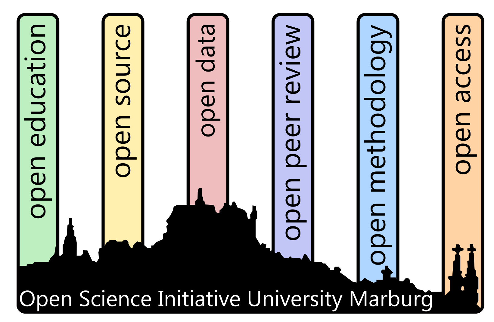

# What is OSIUM?

[Open Science](./open-science.md) is the movement to make scientific research, data, and dissemination accessible to all levels of an inquiring society ([FOSTER](https://www.fosteropenscience.eu/)).
With [OSIUM](./team.md), a grassroots peer2peer initiative at Marburg University, you can be part of this movement: Our aim is to connect early-career researchers by sharing practical workflows in summer schools, hackathons, and retreats.

---

# [Join OSIUM!](./join.md)

OSIUM is an open and voluntary group of researchers and non-researchers from all career stages and disciplines. Membership is free and open to everyone.

  <strong>Why join?</strong>
  <ul>
    <li>Connect with a community committed to transparent, reproducible, and inclusive research</li>
    <li>Gain practical skills and learn from peers across disciplines</li>
    <li>Co-author position papers, best-practice guides, or joint publications</li>
    <li>Organize Open Science events as a MARA working group</li>
  </ul>
  <a href="./join.md" class="benefits-cta">Get involved</a>

OSIUM is happy to collaborate on open research practices or specific projects on open research workflows or open science in teaching. Please feel free to <a href="mailto:osium.contact@gmail.com">drop us a mail</a>!
If you have questions or ideas, or just want to be part of this collaborative community, join our next **Open Office Hour**: We meet online every first Monday of the month at 1:00 pm. All OSIUM activities are announced in our [calendar](./calendar-page.md).

---

# Help Us Shape OSIUM!

To better understand the interests and needs of our community, we would like to hear about your interests, challenges, and ideas. Please take a moment to fill in a few short questions -- your input will help us design workshops, events, and resources that reflect your needs.

[Fill in the OSIUM survey](#osium-survey)

<form action="https://formspree.io/f/mrbqvzwv" method="POST">
  <h2>OSIUM Survey</h2>

  <label>
    1. Which areas of Open Science interest you most?
     
    <textarea name="areas_of_interest" rows="4" cols="80"></textarea>
  </label>

  <label>
    2. What types of activities would you be most interested in?
     
    <textarea name="activities_of_interest" rows="4" cols="80"></textarea>
  </label>

  <label>
    3. What topics or tools would you like to learn more about?
     
    <textarea name="topics_of_interest" rows="4" cols="80"></textarea>
  </label>

  <label>
    4. What barriers or challenges do you face with Open Science?
     
    <textarea name="barriers_to_open_science" rows="4" cols="80"></textarea>
  </label>

  <label>
    5. Any other comments or suggestions?
     
    <textarea name="other_comments" rows="3" cols="80"></textarea>
  </label>

  Interested in helping organise events? Reach out to <a href="mailto:osium.contact@gmail.com">us</a>!

  <button type="submit">Submit</button>
</form>
