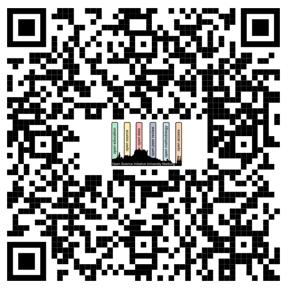

# Concept of the Open Science Days (OSD) 2023

The Open Science Days (OSD) 2023 will take place on **December 4th and 5th** 2023. 
The location will be the **Schulstraße 12 (in Marburg)**. 

---

Here is the planned schedule:

## Day 1 (Monday, 04.12.2023)

| Time | Topic | 
| :---:        |     :---:     |
| 10:00 - 10:15   | Welcome + OSIUM presentation | 
| 10:15 - 11:00    | Open Science / Escape room closed science | 
| 11:00 - 11:30   | Open Data / OSF | 
| 11:30 - 12:30  | Break - Lunch | 
| 12:30 - 13:30  | Preregistration (on OSF) | 
| 13:30 - 14:00   | Project- & Data Management | 
| 14:00 - 14:30   | Versioning | 
| 14:30 - 15:30  | datalad | 
| 15:30 - 16:00  | Break - Coffee |
| 16:00 - 17:30 | Project Work¹ |

## Day 2 (Tuesday, 05.12.2023)

| Time | Topic | 
| :---:        |     :---:     |
| 10:00 - 10:15   | Welcome   |
| 10:15 - 11:00    | R-Markdown |
| 11:00 - 12:00   | Python / Jupyter |
| 12:00 - 13:00  | Break - Lunch  |
| 13:00 - 15:00  | Project Work¹ |
| 15:00 - 15:30  | Break - Coffee |
| 15:30 - 16:00  | Project Presentation¹ |
| 16:00 - 17:00 |  Open Science Discussion² |
| 17:00 | Wrap up - Closing words |

## ¹Project work
**Project Work Slot A: Hands-on session**
During this time slot, you will have the opportunity to implement the Open Science principles and utilize the tools you were introduced to earlier in the day, within the context of your own project. The Teaching Assistants (TAs) will be available to provide assistance and address any questions related to the setup, registration, and management of your project. 

**Project Work Slot B: Registerd Projects**
During this time slot, you have the opportunity to collaborate on projects that have already been registered. 
Already registered projects include:

Project 1: Planning an Open Science Retreat for 2024.
Project 2: Shaping the Future: Open Science Visions for Marburg University.

**Project Presentation**
In this part you can present the group the results of your project work. 

## ²Open Science Discussion
In this session we will discuss Open Science visions with stakeholders of the Philipps University of Marburg.

# Registration
To register for the Open Science Days, please use this <a href="https://docs.google.com/forms/d/e/1FAIpQLSc6gjkEU8vmLSiDUafD4ukE3eGFxA1fEL0OX0ieqjtsxxaoYQ/viewform?usp=sharing">form</a>:

[back](./)
