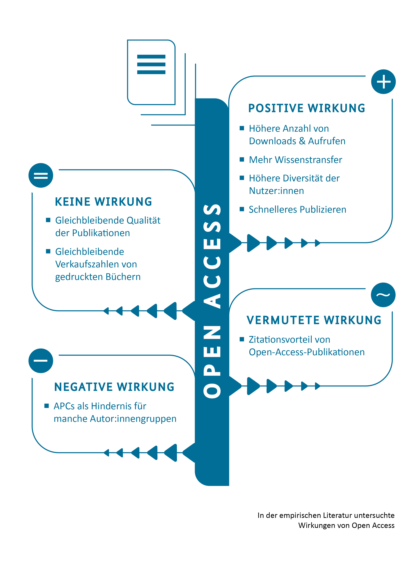
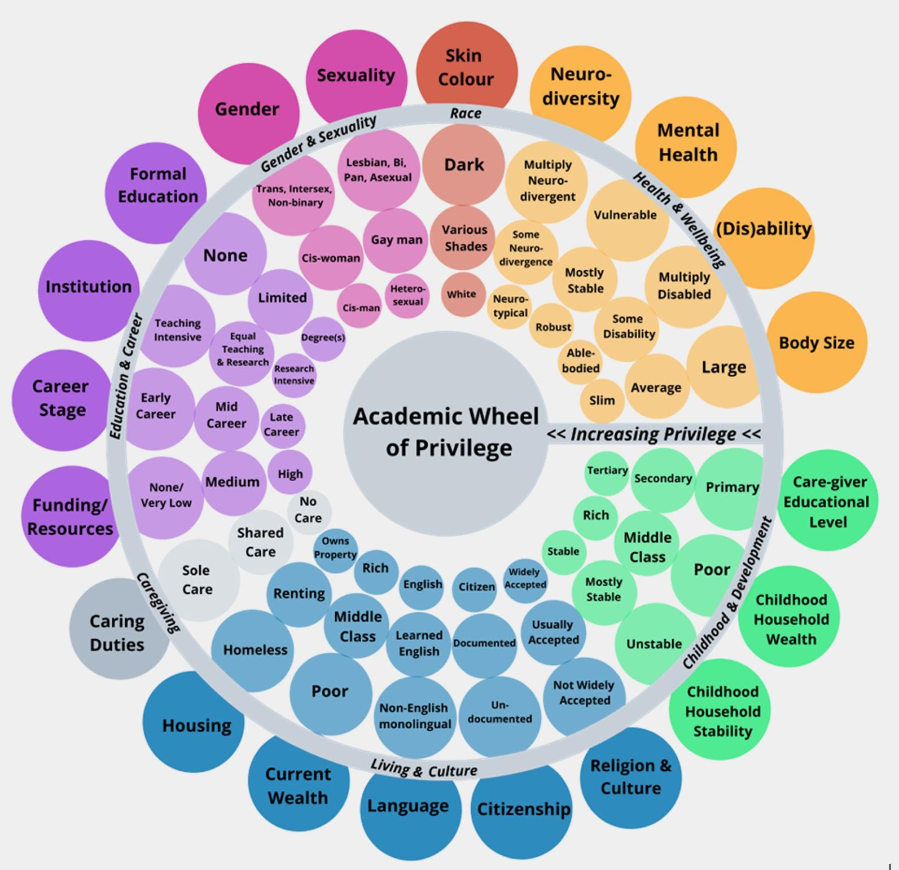
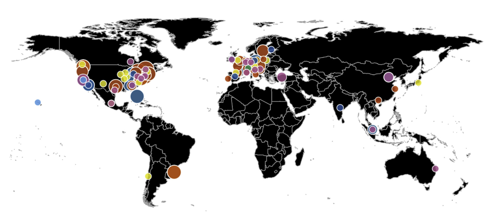

# Reason 1: Open Science can help save our planet
Our interconnected world needs open science to help solve complex social, environmental, and economic challenges and achieve the <a href="https://sdgs.un.org/goals">Sustainable Development Goals</a>.

By promoting science that is more accessible, inclusive and transparent, open science furthers the right of everyone to share in scientific advancement and its benefits as stated in Article 27.1 of the <a href="https://www.un.org/en/about-us/universal-declaration-of-human-rights">Universal Declaration of Human Rights</a>.

<iframe width="560" height="315" src="https://www.youtube.com/embed/I3Wkvx_ZaFo?si=mayYdTcjiGQxZWcw" title="YouTube video player" frameborder="0" allow="accelerometer; autoplay; clipboard-write; encrypted-media; gyroscope; picture-in-picture; web-share" allowfullscreen></iframe>

# Reason 2: Open Science can help promoting your research
With Open Science practices, you can make your entire research workflow transparent and traceable. In this way, you not only help other researchers and interested people from society to understand your research, but also help your future self to understand your data and analyses at a later point in time, to reuse them and actually make them <a href="https://doi.org/10.1038/533452a">reproducible</a>.

Open data and materials are becoming more and more important, not only for journals, but also for research funders like the <a href="https://doi.org/10.5281/zenodo.7193838">DFG</a>, <a href="https://www.bmbf.de/bmbf/de/forschung/zukunftsstrategie/zukunftsstrategie.html">BMBF</a> or <a href="https://www.consilium.europa.eu/media/56958/st10126-en22.pdf">EU</a>. 

Meanwhile, there are not only recommendations like the <a href="https://openaccess.mpg.de/67605/berlin_declaration_engl.pdf">Berlin Declaration on Open Access to Knowledge in the Sciences and Humanities</a>, but also <a href="https://doi.org/10.34657/7666">studies on the impact of open access articles</a>, which suggest a citation advantage as well as a higher added value for society of open access articles.

# Reason 3: open Science can help boosting your career
Are you tired of the publish or perish principle in science?

<iframe width="560" height="315" src="https://www.youtube.com/embed/Y0YYgdSEdu4?si=OraoYHbMGrrMEtyu" title="YouTube video player" frameborder="0" allow="accelerometer; autoplay; clipboard-write; encrypted-media; gyroscope; picture-in-picture; web-share" allowfullscreen></iframe>

Do you not know what your future in science can look like and do you see multiple barriers to your path in academia (#IchBinHanna)?

Do you want to collaborate with colleagues at eye level and think your research future together?

There are many researchers around the world who think just like you and who won't give up trying to change the system for the benefit of all.
Organize with like-minded people in local open science communities like <a href="https://openscienceinitiativeuniversitymarburg.github.io/">OSIUM</a>, international communities like <a href="https://forrt.org/">FORRT</a> or subject-specific communities like the <a href="https://doi.org/10.1016/j.neuron.2021.04.001">Brainhack Community</a>.

**Let's revolutionize science together!**

