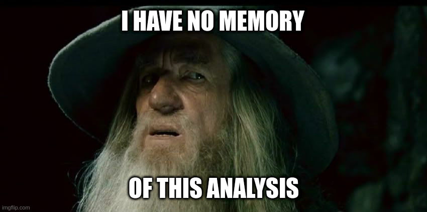

# Reason 1: Something's Going Wrong in Science...

... have you ever heard of (or even already experienced) the **publish or perish** attitude?

<iframe width="560" height="315" src="https://www.youtube.com/embed/Y0YYgdSEdu4?si=OraoYHbMGrrMEtyu" title="YouTube video player" frameborder="0" allow="accelerometer; autoplay; clipboard-write; encrypted-media; gyroscope; picture-in-picture; web-share" allowfullscreen></iframe>

... or of the **reproducibility crisis**?

 (https://www.nature.com/articles/533452a)

... or of #IchBinHanna or **the wheel of priviledge**?

## The good news is: Researchers and scientific staff all over the world researchers are rising up against these problems, for example by making science more open, transparent and reusable for other researchers and the society as a whole.

---

# Reason 2: Open Science Can Help Promoting Your Research
With Open Science practices, you can make your entire research workflow transparent and traceable. In this way, you not only help other researchers and interested people from society to understand your research, but also help your future self to understand your data and analyses at a later point in time, to reuse them and actually make them <a href="https://doi.org/10.1038/533452a">reproducible</a>. So there are many more or less selfish [[1](https://doi.org/10.1186/s13059-015-0850-7)] reasons for reproducibility.

Open data and materials are becoming more and more important, not only for journals, but also for research funders like the DFG [[2](https://doi.org/10.5281/zenodo.7193838)], BMBF [[3](https://www.bmbf.de/bmbf/de/forschung/zukunftsstrategie/zukunftsstrategie.html)] or EU [[4](https://www.consilium.europa.eu/media/56958/st10126-en22.pdf)]. 

Meanwhile, there are not only recommendations like the Berlin Declaration on Open Access to Knowledge in the Sciences and Humanities [[5](https://openaccess.mpg.de/67605/berlin_declaration_engl.pdf)], but also studies on the impact of open access articles [[6](https://doi.org/10.34657/7666)], which suggest a citation advantage as well as a higher added value for society of open access articles.
Literature demonstrates that "open research is associated with increases in citations, media attention, potential collaborators, job opportunities and funding opportunities" [[7](https://doi.org/10.7554/eLife.16800)].

---

# Reason 3: Open Science Can Help Save Our Planet
Our interconnected world needs open science to help solve complex social, environmental, and economic challenges and achieve the <a href="https://sdgs.un.org/goals">Sustainable Development Goals</a>.

By promoting science that is more accessible, inclusive and transparent, open science furthers the right of everyone to share in scientific advancement and its benefits as stated in Article 27.1 of the <a href="https://www.un.org/en/about-us/universal-declaration-of-human-rights">Universal Declaration of Human Rights</a>.

<iframe width="560" height="315" src="https://www.youtube.com/embed/I3Wkvx_ZaFo?si=mayYdTcjiGQxZWcw" title="YouTube video player" frameborder="0" allow="accelerometer; autoplay; clipboard-write; encrypted-media; gyroscope; picture-in-picture; web-share" allowfullscreen></iframe>

[back](./)

