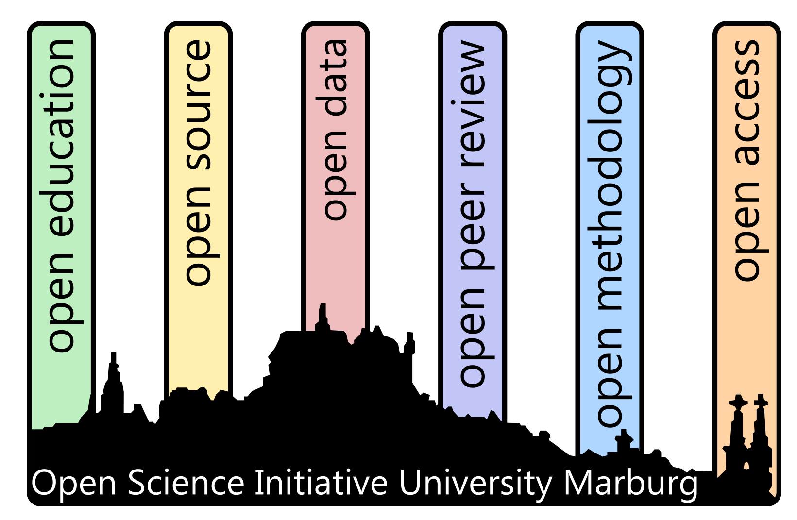

# OSIUM...
... is a grassroot initiative promoting open science at Marburg University.

# Mission
The interdisciplinary Open Science Initiative University Marburg (OSIUM) has the mission to promote and to foster open science practices at Philipps-University Marburg and beyond.

# Activities
We seek to promote Open Science by offering **advanced training programs** (e.g., summer schools) for early career researchers and senior faculty members, public talks, help with the development of **core curricula** on open research practices. Even more, we seek to develop and implement alternative **incentive structures** in science that support the adoption of open science practices.
We also organize open peer-to-peer events like **hackathons** and **retreats** as well as **regular meetings** (e.g., our Open office Hour) to promote the exchange between open science enthusiasts.
For detailed information about the ongoing OSIUM events, please check our [calendar](./calendar-page.md).

# Organizational Structure
### MARA Working Group
Since 2018, OSIUM is an independent <a href="https://www.uni-marburg.de/en/mara/networking/academic-groups/working-group-35/arbeitsgruppe-35-open-science-initiative-university-marburg-2018">MARA working group</a>. open to all members of the university that are interested in the topic of open and sustainable research.

### Collaborations in Marburg
OSIUM collaborates within **Marburg University** with the MArburg Research Academy <a href="https://www.uni-marburg.de/en/mara/">MARA</a>, the <a href="https://www.uni-marburg.de/de/forschung/kontakt/eresearch">eResearch Center</a> and the <a href="https://www.uni-marburg.de/de/universitaet/lehre/zukunftswerkstatt">Zukunftswerkstatt</a>.

### Collaborations Beyond Marburg 
**Beyond Marburg University**, we collaborate with the Hessian Data Infrastructure <a href="https://www.uni-marburg.de/de/hefdi">HeFDI</a> and other Open Science actors in Germany.
OSIUM is member of the Network of Open Science Initiatives <a href="https://osf.io/tbkzh/">NOSI</a> and part of the global <a href="https://mattermost.brainhack.org/">Brainhack Community</a>. We furthermore collaborate with <a href="https://forrt.org/">FORRT</a> and <a href="https://the-turing-way.netlify.app/index.html">The Turing Way</a>.

---

# Current Board Members 

Neuroscientists, biologists, psychologists, physicists, computer scientists, linguists and media scientists have come together to promote Open Science at Marburg University for the benefit of all sciences. We are always looking for new Open Science enthusiasts to join the team!

<a href="https://www.researchgate.net/profile/Monica-Berdugo-Moreno">Monica B. Berdugo</a>, <a href="https://github.com/thecyclingcyclopse">Thomas S. Hartmann</a>, <a href="https://de.linkedin.com/in/julia-katharina-pfarr-2a6437236">Julia Pfarr</a>, <a href="https://orcid.org/0000-0003-4131-7891">Lydia Riedl</a>, <a href="https://de.linkedin.com/in/bj%C3%B6rn-siepe-11a750219">Björn Siepe</a>, <a href="https://github.com/vogelbac">Christoph Vogelbacher</a>

# Former Board Members 
<a href="https://de.linkedin.com/in/karlinhossner">Karlin Hossner</a>, <a href="https://de.linkedin.com/in/ina-thome-a31766182">Ina Thome</a>

# Founders
<a href="https://github.com/JoseAlanis">José Alanis</a>, <a href="https://github.com/MalteGueth">Malte Gueth</a>, <a href="https://github.com/PeerHerholz">Peer Herholz</a>, <a href="https://www.ukgm.de/ugm_2/deu/umr_psy/umr_psy_team.php?id=1398">Jens Sommer</a>, <a href="https://github.com/vogelbac">Christoph Vogelbacher</a>

# Supporter List
_going to come_

---

# Code of Conduct
OSIUM is dedicated to providing a harassment-free experience for everyone. As OSIUM members collaborate closely with the Brainhack Community, we declare the <a href="https://brainhack.org/code-of-conduct.html">Code of Conduct</a> of the Brainhack Community as valid also for the events organized by OSIUM. We expect the Code of Conduct to be honored by everyone who participates in the OSIUM community or claims any affiliation with OSIUM. This code is not exhaustive or complete. We ask community members to adhere to it as much in spirit as in letter to create a safe and positive experience for all.

[back](./)
