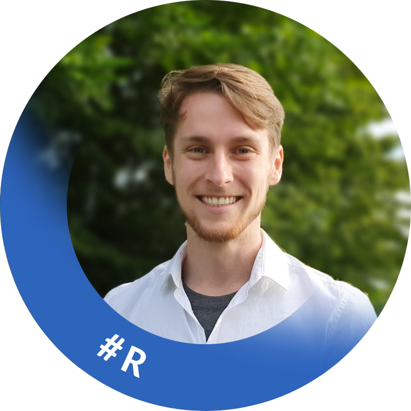
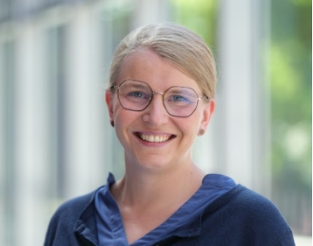
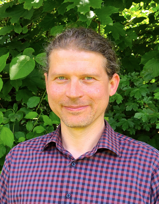
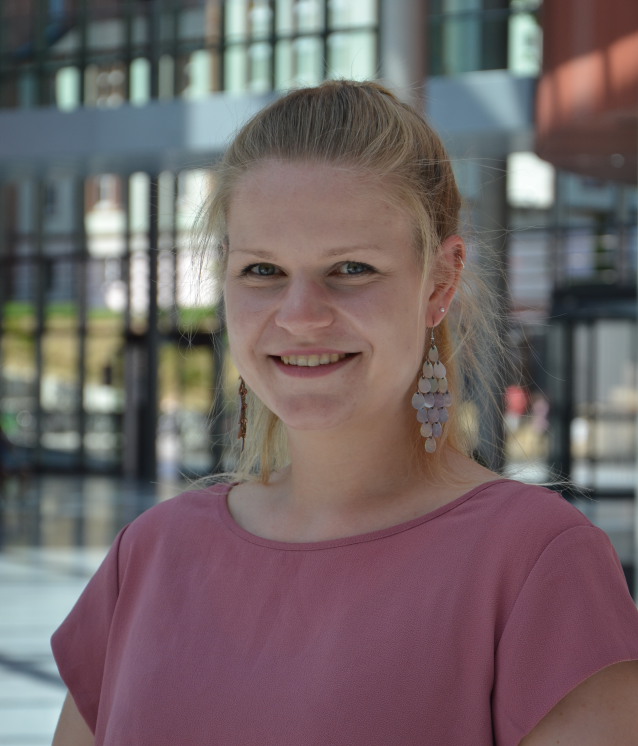
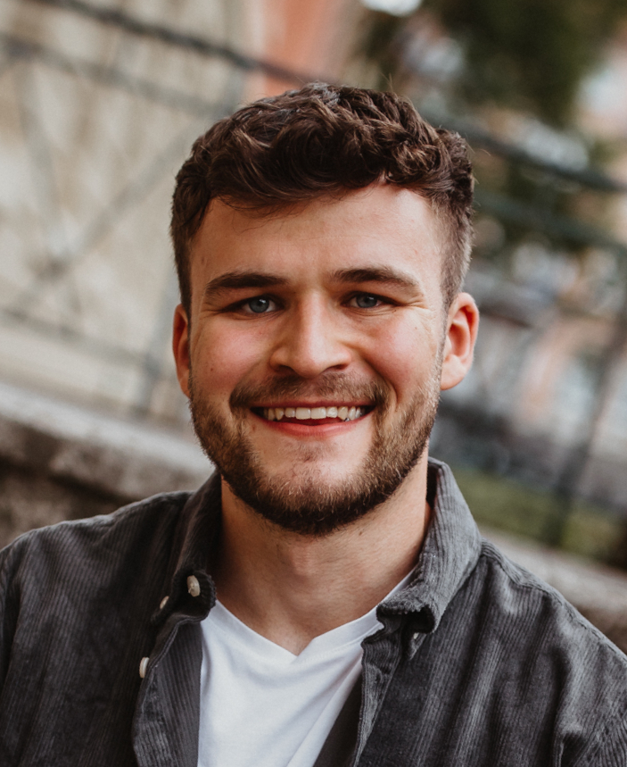

# OSIUM...
... is a grassroot peer2peer initiative promoting open science at Marburg University.

# Activities
We seek to promote Open Science by offering:
- [peer2peer training programs](./past-events.md) (e.g., summer schools and hackathons) for early career researchers and senior faculty members
- [Train the Trainer Retreats](./train-the-trainer-retreat-2025.md) for people who (want to) integrate open science into their teaching
- Contributions to <a href="https://www.uni-marburg.de/de/forschung/kontakt/eresearch/open-science">central Open Science services</a> in collaboration with the infrastructure units of Philipps-Universität Marburg

# Current Board Members 

Neuroscientists, biologists, psychologists, physicists, computer scientists, linguists, and media scientists have come together to promote Open Science at Marburg University for the benefit of all sciences. We are always looking for new Open Science enthusiasts to [join the team](./join)!

<a href="https://www.linkedin.com/in/niau/">Nick Augustat</a>, <a href="https://www.researchgate.net/profile/Monica-Berdugo-Moreno">Monica B. Berdugo</a>, <a href="https://www.uni-marburg.de/de/universitaet/lehre/zukunftswerkstatt/das-team/sophia-hercher">Sophia Hercher</a>, <a href="https://www.uni-marburg.de/de/fb20/bereiche/methoden-gesundheit/allgprmed/abteilung/personen/dr-rer-soc-konrad-hierasimowicz">Konrad Hierasimowicz</a>, <a href="https://orcid.org/0000-0003-4131-7891">Lydia Riedl</a>, <a href="https://de.linkedin.com/in/bj%C3%B6rn-siepe-11a750219">Björn Siepe</a>, <a href="https://www.linkedin.com/in/franziska-us%C3%A9e/">Franziska Usée</a>

<table align="center" style="width: 70%; table-layout: fixed; margin-bottom: 40px;">
  <tr>
    <td align="center" style="vertical-align: top; padding: 10px;">
      <h3><a href="https://www.linkedin.com/in/niau/">Nick Augustat</a></h3>
      
      

        Doctoral Researcher, Fachbereich Psychologie, AE Theoretische Kognitionswissenschaft 
        Data Steward, HRZ, Abteilung Anwendungen, Arbeitsgruppe Forschungsnahe Anwendungen 
        I'm interested in computational modelling of reinforcement learning, and I help researchers get access to advanced computing infrastructure. Feel free to drop me a mail!
      

    </td>
  </tr>
</table>

<table align="center" style="width: 70%; table-layout: fixed; margin-bottom: 40px;">
  <tr>
    <td align="center" style="vertical-align: top; padding: 10px;">
      <h3><a href="https://www.researchgate.net/profile/Monica-Berdugo-Moreno">Monica B. Berdugo</a></h3>
      
      

        I am an ecologist. My ultimate research goal is to understand how ecosystem processes, plant communities, and selected plant species respond to environmental drivers to assess the potential impacts of environmental change on the functioning of future ecosystems. By addressing ecosystem processes, such as forest regeneration, plant adaptation, and water, nutrient, and carbon cycling, I seek to disentangle the contributions of plant–plant interactions and environmental filtering on community assemblage and plant performance. Currently, I am based at the Biology Department (FB17) of Marburg University targeting two forest tree species that are structurally crucial to European forests. As a member of the BMBF-funded EpiSOMA project, I test whether within-tree microenvironmental gradients affect methylation patterns and gene expression diversity in Fagus sylvatica, the European beech. As a member of the DFG-funded Phytoakmeter Research Unit, I study the epigenetic changes and mobile transposable elements in response to stress and micro- and macroclimatic gradients by monitoring the progeny of an oak clone planted across an European environmental transect.
      

    </td>
  </tr>
</table>

<table align="center" style="width: 70%; table-layout: fixed; margin-bottom: 40px;">
  <tr>
    <td align="center" style="vertical-align: top; padding: 10px;">
      <h3><a href="https://www.uni-marburg.de/de/universitaet/lehre/zukunftswerkstatt/das-team/sophia-hercher">Sophia Hercher</a></h3>
      
      

        I am a high-school teacher by training. My subjects are English, Ethics, and Philosophy. Currently, however, I work as an instructional designer at Marburg University,
        coordinating the project „Zukunftswerkstatt für digital gestützte Hochschullehre“ (Future workshop for digitally enhanced teaching and learning). Within my job, I support
        teachers at the university in their digital teaching endeavors. Apart from that, I am engaged in fostering Open Educational Resources and Education for Sustainable Development.
        Right now, the topic of AI is very demanding, such that I try to understand as much as possible to support people in dealing with this disruptive technology in their
        teaching. In this context, I also do some metaphor research as a hobby.
      

    </td>
  </tr>
</table>

<table align="center" style="width: 70%; table-layout: fixed; margin-bottom: 40px;">
  <tr>
    <td align="center" style="vertical-align: top; padding: 10px;">
      <h3><a href="https://www.uni-marburg.de/de/fb20/bereiche/methoden-gesundheit/allgprmed/abteilung/personen/dr-rer-soc-konrad-hierasimowicz">Konrad Hierasimowicz</a></h3>
      
      

        Research Associate at the Institute of General Practice/Family Medicine (Institut für Allgemeinmedizin, Philipps-Universität Marburg). 
        Academic interests: sociology (knowledge and media sociology) and computer science (operating systems, databases). 
        Open science focus: open-source software and operating systems (GNU/Linux), open methodology. 
      

    </td>
  </tr>
</table>

<table align="center" style="width: 70%; table-layout: fixed; margin-bottom: 40px;">
  <tr>
    <td align="center" style="vertical-align: top; padding: 10px;">
      <h3><a href="https://orcid.org/0000-0003-4131-7891">Lydia Riedl</a></h3>
      
      

        Linguist and Neuroscientist 
        Promoting Open Science in Marburg (and beyond) as:
      

      <ul style="list-style-position: inside; text-align: left; margin: 0 auto; width: 100%;">
        <li>Open Science Officer of Philipps-Universität Marburg</li>
        <li>Repository Manager and Open Repositories Group Lead</li>
        <li>Member of the Marburg eResearch Center</li>
        <li>Steering board member of the German Reproducibility Network</li>
        <li>Proud board member of OSIUM</li>
      </ul>
    </td>
  </tr>
</table>

<table align="center" style="width: 70%; table-layout: fixed; margin-bottom: 40px;">
  <tr>
    <td align="center" style="vertical-align: top; padding: 10px;">
      <h3><a href="https://de.linkedin.com/in/bj%C3%B6rn-siepe-11a750219">Björn Siepe</a></h3>
      
      

        Doctoral Student in the Psychological Methods Lab, Department of Psychology 
        My work focuses on developing and evaluating statistical methods for time series analysis in psychology,  time series analysis in clinical applications, and meta research on robust methodological research.
      

    </td>
  </tr>
</table>

<table align="center" style="width: 70%; table-layout: fixed; margin-bottom: 40px;">
  <tr>
    <td align="center" style="vertical-align: top; padding: 10px;">
      <h3><a href="https://www.linkedin.com/in/franziska-us%C3%A9e/">Franziska Usée</a></h3>
      
      

        I am a doctoral student in Clinical Psychology and Psychotherapy. My PhD focuses on applying computational modeling to approach–avoidance conflict behavior to improve the
        understanding of anxiety disorders. More broadly, I am interested in integrating advanced data science methods into psychological research and data analysis.
      

    </td>
  </tr>
</table>

# Supporter List
_This list is not yet complete and will be continuously updated._

* Prof. Dr. Dominik Endres
* Prof. Dr. Andreas Jansen
* Prof. Dr. Daniel Heck
* Prof. Dr. Andreas Mayr
* Dr. Sarah-Mai Dang
* Prof. Dr. Peter Bell

# Former Board Members 
<a href="https://de.linkedin.com/in/julia-katharina-pfarr-2a6437236">Julia Pfarr</a>, <a href="https://github.com/vogelbac">Christoph Vogelbacher</a>, <a href="https://github.com/thecyclingcyclopse">Thomas S. Hartmann</a>, <a href="https://de.linkedin.com/in/karlinhossner">Karlin Hossner</a>, <a href="https://de.linkedin.com/in/ina-thome-a31766182">Ina Thome</a>

# Founders
<a href="https://github.com/JoseAlanis">José Alanis</a>, <a href="https://github.com/MalteGueth">Malte Gueth</a>, <a href="https://github.com/PeerHerholz">Peer Herholz</a>, <a href="https://www.ukgm.de/ugm_2/deu/umr_psy/umr_psy_team.php?id=1398">Jens Sommer</a>, <a href="https://github.com/vogelbac">Christoph Vogelbacher</a>

---

# Organizational Structure
### MARA Working Group
Since 2018, OSIUM is an independent <a href="https://www.uni-marburg.de/en/mara/networking/academic-groups/working-group-35/arbeitsgruppe-35-open-science-initiative-university-marburg-2018">MARA working group</a>. open to all members of the university that are interested in the topic of open and sustainable research.

### Collaborations in Marburg
OSIUM collaborates within **Marburg University** with the MArburg Research Academy <a href="https://www.uni-marburg.de/en/mara/">MARA</a>, the <a href="https://www.uni-marburg.de/de/forschung/kontakt/eresearch">eResearch Center</a> and the <a href="https://www.uni-marburg.de/de/universitaet/lehre/zukunftswerkstatt">Zukunftswerkstatt</a>.

### Collaborations Beyond Marburg 
**Beyond Marburg University**, we collaborate with the Hessian Data Infrastructure <a href="https://www.uni-marburg.de/de/hefdi">HeFDI</a> and other Open Science actors in Germany.
OSIUM is member of the Network of Open Science Initiatives <a href="https://osf.io/tbkzh/">NOSI</a> and part of the global <a href="https://mattermost.brainhack.org/">Brainhack Community</a>. We furthermore collaborate with <a href="https://forrt.org/">FORRT</a> and <a href="https://the-turing-way.netlify.app/index.html">The Turing Way</a>.

---

# Code of Conduct
OSIUM is dedicated to providing a harassment-free experience for everyone. As OSIUM members collaborate closely with the Brainhack Community, we declare the <a href="https://brainhack.org/code-of-conduct.html">Code of Conduct</a> of the Brainhack Community as valid also for the events organized by OSIUM. We expect the Code of Conduct to be honored by everyone who participates in the OSIUM community or claims any affiliation with OSIUM. This code is not exhaustive or complete. We ask community members to adhere to it as much in spirit as in letter to create a safe and positive experience for all.

---

# [JOIN OUR TEAM!](./join.md)

[back](./)
