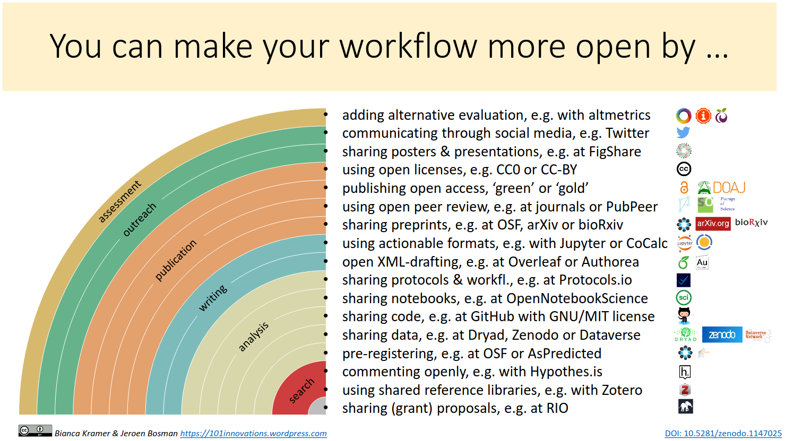

The Open Science community is constantly developing new open tools, platforms and standards that help to make your research transparent, open and reusable. 

---

# Tools created by OSIUM members

<a href="https://g0rella.github.io/gorella_mwn/index.html">G0rella: open science learning modules for neuroscience</a>

<a href="https://sfbs.pages.uni-marburg.de/sfb135/nowa/nowa.site/workshop/">Julia’s workshops for neuroscience</a>

<a href="https://zenodo.org/communities/hefdi/?page=1&size=20">Lydia's slides on Open Science in general</a>

**Some further tools are linked below:**

__Tool Overviews__

<a href="https://101innovations.wordpress.com/">Tools Overview</a>

<a href="https://tilburgsciencehub.com/">Tilburg Sciewnce Hub</a>

__Learning Materials__

<a href="https://www.cos.io/communities/open-scholarship-knowledge-base">Open Scholarship Knowledge Base</a>

<a href="https://www.fosteropenscience.eu/">FOSTER Open Science</a>

<a href="https://the-turing-way.netlify.app//">The Turing Way</a>

<a href="[https://www.fosteropenscience.eu/](https://forrt.org/nexus/)">FORRT</a>

__Training__

<a href="https://carpentries.org/workshops-curricula/">Carpentries</a>

<a href="https://www.fosteropenscience.eu/">FOSTER Open Science</a>

<a href="https://repro4everyone.org/">Repor4Everyone</a>

---

# Open Science at Marburg University

<a href="https://www.uni-marburg.de/de/open-science/">Here you can find an overview over the Open Science related services at Philipps-University Marburg</a>

[back](./)
