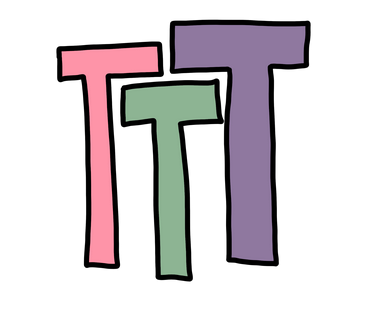
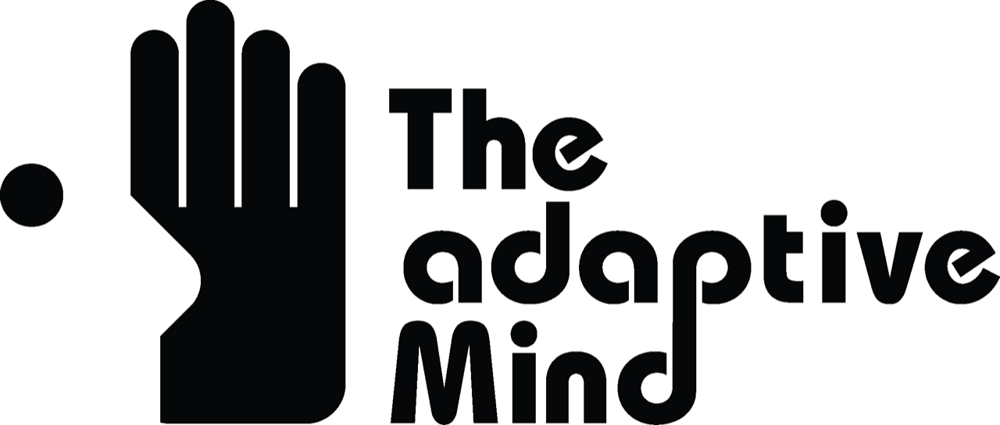

## Train the Trainer Retreat - digital skills in research

Digital skills in research range from basic skills in the use of digital tools and platforms to advanced knowledge in specific areas. These skills are needed more than ever, especially in future-oriented areas such as

→ **Open science**: knowledge of open access publishing, sharing research data,, the use of open source software and collaboration in research. This also includes strategies for improving the transparency and reproducibility of scientific workflows.

→ **Data literacy**: Skills for collecting, storing, analyzing, interpreting and presenting data. This includes the creation of data management plans and preregistrations as well as data visualization and the application of statistical methods.

→ **Coding competence / research software engineering**: Knowledge of the use of software and, if necessary, programming, which is necessary for the implementation and automation of data collection, processing and analysis. This also includes the application of computer-aided methods and technologies to solve complex scientific problems.

 

 

Imparting this knowledge and skills in university teaching helps to ensure high-quality research and make it sustainable.
We are therefore organizing a retreat for multipliers who would like to integrate these extremely important topics into their teaching and supervision.

→ <a href="https://redcap.kks.uni-marburg.de/surveys/?s=9HXRRT48NNE4LFRW">REGISTER</a>

During the Train the Trainer (TTT) retreat, we will work with our trainer Dr. Heidi Seibold from the Digital Research Academy to expand and optimize our didactic skills for precisely these areas. The Digital Research Academy offers customized, high-quality training in order to optimally teach digital research skills.
 
Do you want to offer excellent teaching for sustainable, high-quality research?
Then the TTT Retreat could be the ideal place for you!

**Schedule**:

| Date | Event | Setting |
|:---------------|:--------------|:---------------|
| 03.09. 13-15 h | Kick-Off | Online meeting to discuss the course of the TTT and the necessary preparation for the TTT |
| 30.09. 12 h – 02.10. 12 h | TTT Retreat | On-site workshop at the Philipps University Marburg student residence on Lake Edersee |

In the period between the kick-off and the TTT workshop, the participants prepare didactic sessions, which they present at the TTT workshop. After the TTT there is the opportunity to receive and give peer feedback for courses and training sessions.

| | Event: Kick-Off | Event: TTT Retreat |
|:---------------|:--------------|:---------------|
| **date** | 03.09. 13:00-15:00 h | 30.09. 12:00 h - 02.10. 12:00 h |
| **location** | online | Philipps University Marburg <a href="https://www.uni-marburg.de/de/zfh/studienheim">student residence on Lake Edersee</a> |
| **costs** | | Students of Philipps-University Marburg: 20,-€   Staff of  Philipps-University Marburg: 40,-€   External staff: 60,-€     plus meals¹ |

¹ The Philipps-University student residence is a self-catering house. Catering will be organized centrally by the TTT Retreat organization team. The costs are expected to be around €30 per person.

**Program**:

| | Time | Session |
|:---------------|:--------------|:---------------|
| 30.09.2024 | 12:00 - 15:30 | Welcome & Introduction to Open Science |
| 30.09.2024 | 15:30 - 17:30 | Didactics Session 1 |
| 01.10.2024 | 09:00 - 12:00 | Didactics Session 2 |
| 01.10.2024 | 12:00 - 13:30 | Lunch Break |
| 01.10.2024 | 13:30 - 17:30 | Didactics Session 3 |
| 01.10.2024 | 17:30 - 19:00 | Practical Didactics Training |
| 02.10.2024 | 09:00 - 12:00 | Didactics Session 4 & Wrap Up |

→ <a href="https://redcap.kks.uni-marburg.de/surveys/?s=9HXRRT48NNE4LFRW">REGISTER</a>

The TTT program is run by the <a href="https://digital-research.academy/">Digital Research Academy</a>. If you wish, you can join the Digital Research Academy Trainer Community after the program.

The TTT Retreat is organized by 

and supported by

 
 
[back](./)
