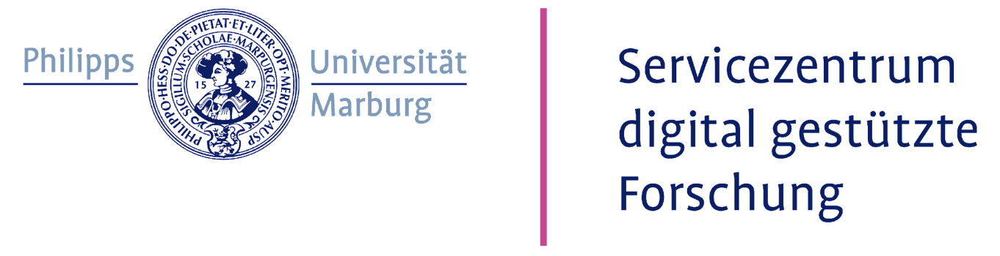

# Train the Trainer Retreat - Digital Skills & Open Science in Higher Education on 03.11.2025 in Marburg

Digital skills in research range from basic skills in the use of digital tools and platforms to advanced knowledge in specific areas. These skills are needed more than ever, especially in future-oriented areas such as

→ **Open science**: knowledge of open access publishing, sharing research data,, the use of open source software and collaboration in research. This also includes strategies for improving the transparency and reproducibility of scientific workflows.

→ **Data literacy**: Skills for collecting, storing, analyzing, interpreting and presenting data. This includes the creation of data management plans and preregistrations as well as data visualization and the application of statistical methods.

→ **Coding competence / research software engineering**: Knowledge of the use of software and, if necessary, programming, which is necessary for the implementation and automation of data collection, processing and analysis. This also includes the application of computer-aided methods and technologies to solve complex scientific problems.

Imparting this knowledge and skills in university teaching helps to ensure high-quality research and make it sustainable.
We are therefore organizing a retreat for multipliers who would like to integrate these extremely important topics into their teaching and supervision.

 

 

→ <a href="https://redcap.kks.uni-marburg.de/surveys/?s=9TWKDAF8KWYPM7CN">REGISTER</a>

**Event Format**

The One-Day Train the Trainer (TTT) retreat is is conceptualized as a one-day unconference: the participants share their own teaching ideas, receive targeted feedback, and learn from the proven didactic concepts of others.

During the TTT retreat, we will work to expand and optimize our didactic skills for precisely these areas. 
 
Do you want to offer excellent teaching for sustainable, high-quality research?
Then the TTT Retreat could be the ideal place for you!

**Schedule**:

| Date | Event | Setting |
|:---------------|:--------------|:---------------|
| October 20 13:00-14:00 | Kick-Off | Online meeting to discuss the course of the TTT and the necessary preparation for the TTT |
| November 3, 10:00 – 18:00 | TTT Retreat | On-site workshop in Creative Space Marburg, "Club Behring" (Room +1/0020), 1. OG  Bahnhofstraße 7, 35037 Marburg |

In the period between the kick-off and the TTT workshop, the participants prepare didactic sessions, which they present at the TTT workshop.

**costs**: The participation is for free!

→ <a href="https://redcap.kks.uni-marburg.de/surveys/?s=9TWKDAF8KWYPM7CN">REGISTER</a>

The TTT Retreat is organized by 

and supported by

and

 
 
[back](./)
